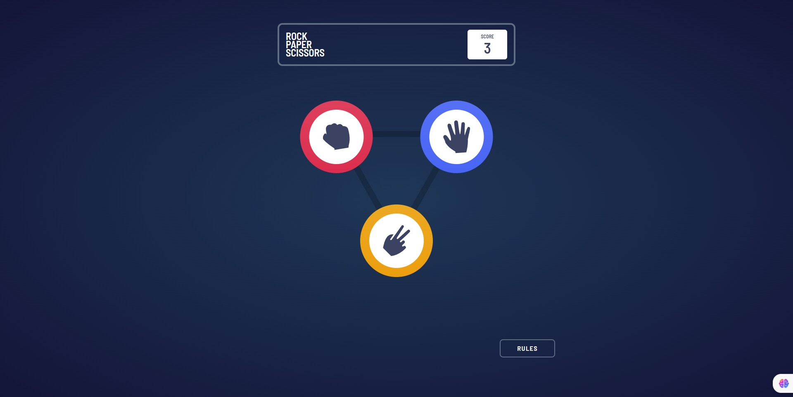

# Frontend Mentor - Rock, Paper, Scissors solution

This is a solution to the [Rock, Paper, Scissors challenge on Frontend Mentor](https://www.frontendmentor.io/challenges/rock-paper-scissors-game-pTgwgvgH). Frontend Mentor challenges help you improve your coding skills by building realistic projects.

## Table of contents

- [Overview](#overview)
  - [The challenge](#the-challenge)
  - [Screenshot](#screenshot)
  - [Links](#links)
- [My process](#my-process)
  - [Built with](#built-with)
  - [What I learned](#what-i-learned)
- [Author](#author)

## Overview

### The challenge

Users should be able to:

- View the optimal layout for the game depending on their device's screen size
- Play Rock, Paper, Scissors against the computer
- Maintain the state of the score after refreshing the browser _(optional)_
- **Bonus**: Play Rock, Paper, Scissors, Lizard, Spock against the computer _(optional)_

### Screenshot



### Links

- Solution URL: [Solution URL here](https://github.com/nevredimiy/rock-paper-scissers)
- Live Site URL: [Live site URL here](https://rock-paper-scissors-f0gi.onrender.com/)

## My process

### Built with

- Semantic HTML5 markup
- CSS custom properties
- Flexbox
- CSS Grid
- Mobile-first workflow
- [React](https://reactjs.org/) - JS library
- [Tailwindcss](https://tailwindcss.com/) - For styles

### What I learned

My major learnings while working through this project is used are hooks. It's useRef, Routes, useContext. Last hook (useContext) was very dificult for me. I had to remember for a long time how to use this hook in other components that are located in different files. An error occurred when importing a hook - such a hook does not exist. I forgot to export this hook in the main file.

```root.js
export const PointsContext = React.createContext();
```
And I encountered another problem that could not be solved. She is associated with Tailwindcss. When I generate css styles, tailwindcss does not have time to create these css tables in its file. I had to use a trick. I created empty blocks with the desired styles. Perhaps someone knows how to get around this problem. I will be glad to help.

```components/Main.jsx
{/* a little problem */}
  <div className="rotate-[30deg]"></div>
  <div className="rotate-[150deg]" ></div>
  <div className="rotate-[270deg]"></div>
  <div className="-rotate-[30deg]"></div>
  <div className="-rotate-[150deg]"></div>
  <div className="-rotate-[270deg]"></div>
```
## Author
- Website - [Artem](https://writecode6.wordpress.com/%d0%be%d0%b1%d0%be-%d0%bc%d0%bd%d0%b5/)
- Frontend Mentor - [@nevredimiy](https://www.frontendmentor.io/profile/nevredimiy)
- Youtube - [@write-code](https://studio.youtube.com/channel/UCnmIQSMt8ayFgE2deKtAaKQ)
